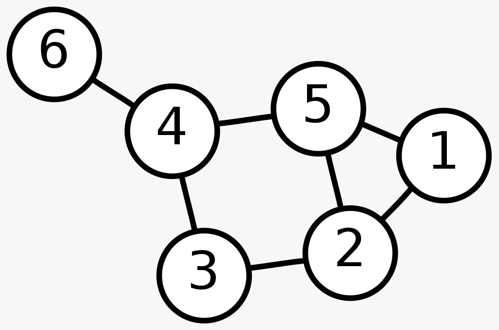

# Grafos - Graph (Implementação Estática)
Gabriel de Souza Rosa

---
## Apresentação
A teoria dos grafos ou de grafos é um ramo da matemática que estuda as relações entre os objetos de um determinado conjunto. Para tal são empregadas estruturas chamadas de grafos, G(V,E), onde V é um conjunto não vazio de objetos denominados vértices (ou nós) e E (do inglês edges - arestas) é um subconjunto de pares não ordenados de V.
<br> <br>
Dependendo da aplicação, arestas podem ou não ter direção, pode ser permitido ou não arestas ligarem um vértice a ele próprio e vértices e/ou arestas podem ter um peso (numérico) associado. Se as arestas têm um sentido associado (indicado por uma seta na representação gráfica) temos um dígrafo (grafo orientado).
<br> <br>
Na estrutura deste corpo, foi abordado um grafo que possibilita em suas configurações iniciais a propriedade de ser dígrafo (grafo orientado) e/ou ponderado (é atribuído um peso as arestas).
<br> <br>
objetivando facilitar na compreensão do código, o elaboramos de maneira estática, conservando a trivialidade. O que resulta em um custo assintótico mais elevado devido ao uso de estruturas de repetição e variáveis estáticas.
Para a implementação de tal estrutura se fez necessário as seguintes funções:

```C
typedef struct graph Graph;

struct graph{
    int is_weighted;                //Suas arestas são pondeiradas?
    int numb_vertices;              //Número de vertices máximo do grafo
    int max_degree;                 //Maior grau de ligações (qtd maxima de arestas ligadas a um unico vertice)
    int** edges;                    //Arestas do grafo (Matriz [vertices][qtd conexões])
    float** weights;                //Pesos do grafo (Caso vá trabalhar com grafos ponderados)
    int* grade;                     //Vetor que guarda quantas arestas estão conecetados em cada vertice
};

//Criação e exclusão do grafo
Graph *Create_Graph(int numb_vertices, int max_degree, int is_weighted);                    //Cria o grafo alocando varios espaços de memória
void Clean_Graph(Graph *graph);                                                             //Deleta o grafo

//inserção e remoção
int insertEdges(Graph *graph, int origin, int destiny, int is_digraph, float weight);       //Insere elementos no grafo
int removeEdges(Graph *graph, int origin, int destiny, int is_digraph);                     //Remove o elemento colocando a ultima interação na posição a ser removida

//Buscas
//Busca em profundidade
void deepSearch_Graph(Graph *graph, int origin, int *visited);                              //(Função principal) -> Faz interface com o usuario
void deepSearch(Graph *graph, int origin, int *visited, int cont);                          //(Função auxiliar) -> Realiza o cálculo
//Busca em largura
void searchWidth_Graph(Graph *graph, int origin, int *visited);
//Busca pelo menor caminho
int searchShortestPath(float *distance, int *visited, int NV);                              //Procura vertice com menor distância que não tenha sido visitado
void searchShortestPath_Graph(Graph *graph, int origin, int *previous, float *distance);

//Arvore Geradora Mínima (cria um sub grafo com o menor número de arestas)
//As arestas são pondeiradas e o sub grafo mantém as de menores custos, 
void algPRIM_Graph(Graph *graph, int origin, int *father);                                  //Considera um vertice inicial para a construção da arvore (constroi uma unica arvore ao longo do tempo)
```
<br>

---
## Representação Gráfica
<br>
Os grafos são geralmente representados graficamente da seguinte maneira: é desenhado um círculo para cada vértice, e para cada aresta é desenhado um arco conectando suas extremidades. Se o grafo for direcionado, seu sentido é indicado na aresta por uma seta.
<br> 
<p align="center">
    
</p>
<br> 
O grafo de exemplo exibido na figura é um grafo simples com o conjunto de vértices V = {1, 2, 3, 4, 5, 6} e um conjunto de arestas E = { {1,2}, {1,5}, {2,3}, {2,5}, {3,4}, {4,5}, {4,6} }
<br> 
Note que essa representação gráfica não deve ser confundida com o grafo em si (a estrutura abstrata, não gráfica). Diferentes representações gráficas podem corresponder ao mesmo grafo. O que importa é quais vértices estão conectados entre si por quantas arestas.

---
## Caminho
<br>
Caminho é uma sequência de vértices tal que de cada um dos vértices existe uma aresta para o vértice seguinte. Um caminho é chamado simples se nenhum dos vértices no caminho se repete. O comprimento do caminho é o número de arestas que o caminho usa, contando-se arestas múltiplas vezes. O custo de um caminho num grafo balanceado é a soma dos custos das arestas atravessadas. Dois caminhos são independentes se não tiverem nenhum vértice em comum, exceto o primeiro e o último.
<br> 
No grafo de exemplo, (1, 2, 5, 1, 2, 3) é um caminho com comprimento 5, e (5, 2, 1) é um caminho simples de comprimento 2.
<br> 

**Caminho euleriano** em um grafo é o caminho que usa cada aresta exatamente uma vez. Se tal caminho existir, o grafo é chamado traversável. Um ciclo euleriano é um ciclo que usa cada aresta exatamente uma vez.
<br> 

**Caminho hamiltoniano** em um grafo é o caminho que visita cada vértice exatamente uma vez. Um ciclo hamiltoniano é um ciclo que visita cada vértice uma só vez. O grafo do exemplo contém um caminho hamiltoniano. Enquanto determinar se um dado grafo contém um caminho ou ciclo euleriano é trivial, o mesmo problema para caminhos e ciclos hamiltonianos é trabalhoso.
<br> 

**Ciclo** (ou circuito) é um caminho que começa e acaba com o mesmo vértice. Ciclos de comprimento 1 são laços. No grafo de exemplo, (1, 2, 3, 4, 5, 2, 1) é um ciclo de comprimento 6. Um ciclo simples é um ciclo que tem um comprimento pelo menos de 3 e no qual o vértice inicial só aparece mais uma vez, como vértice final, e os outros vértices aparecem só uma vez. No grafo acima, (1, 5, 2, 1) é um ciclo simples. Um grafo chama-se acíclico se não contém ciclos simples.
<br> 

**Laço** (loop) num grafo ou num dígrafo é uma aresta e em E cujas terminações estão no mesmo vértice.
<br> 

---
## Buscas em Grafos

**Busca em extensão ou largura:** (Breadth-First Search ou BFS). A propriedade especial está no fato de a árvore não possuir ciclos: dados dois vértices quaisquer, existe exatamente 1 caminho entre eles. Um percurso em extensão é visitar cada nó começando do menor nível e move-se para os níveis mais altos nível após nível, visitando cada nó da esquerda para a direita. Sua implementação é direta quando uma fila é utilizada. Depois que um nó é visitado, seus filhos, se houver algum, são colocados no final da fila e o nó no início da fila é visitado. Assim, os nós do nível n+1 serão visitados somente depois de ter visitados todos os nós do nível n. Computa a menor distância para todos os vértices alcançáveis. O sub-grafo contendo os caminhos percorridos é chamado de breadth-first tree.
<br> 

**Busca em profundidade:** (Depth-first search ou DFS). Um algoritmo de busca em profundidade realiza uma busca não-informada que progride através da expansão do primeiro nó filho da árvore de busca, e se aprofunda cada vez mais, até que o alvo da busca seja encontrado ou até que ele se depare com um nó que não possui filhos (nó folha). Então a busca retrocede (backtrack) e começa no próximo nó. Numa implementação não-recursiva, todos os nós expandidos recentemente são adicionados a uma pilha, para realizar a exploração. A complexidade espacial de um algoritmo de busca em profundidade é muito menor que a de um algoritmo de busca em largura. A complexidade temporal de ambos algoritmos são proporcionais ao número de vértices somados ao número de arestas dos grafos aos quais eles atravessam. Quando ocorrem buscas em grafos muito grandes, que não podem ser armazenadas completamente na memória, a busca em profundidade não termina, em casos onde o comprimento de um caminho numa árvore de busca é infinito. O simples artifício de “ lembrar quais nós já foram visitados ” não funciona, porque pode não haver memória suficiente. Isso pode ser resolvido estabelecendo-se um limite de aumento na profundidade da árvore.
<br> 
    
---
## Referências:
<a href="https://pt.wikipedia.org/wiki/Teoria_dos_grafos#:~:text=no%20mesmo%20v%C3%A9rtice.-,Tipos%20de%20grafos,%C3%A9%20igual%20%C3%A0%20sua%20val%C3%AAncia.">Wikipedia.org</a>
<br/>

